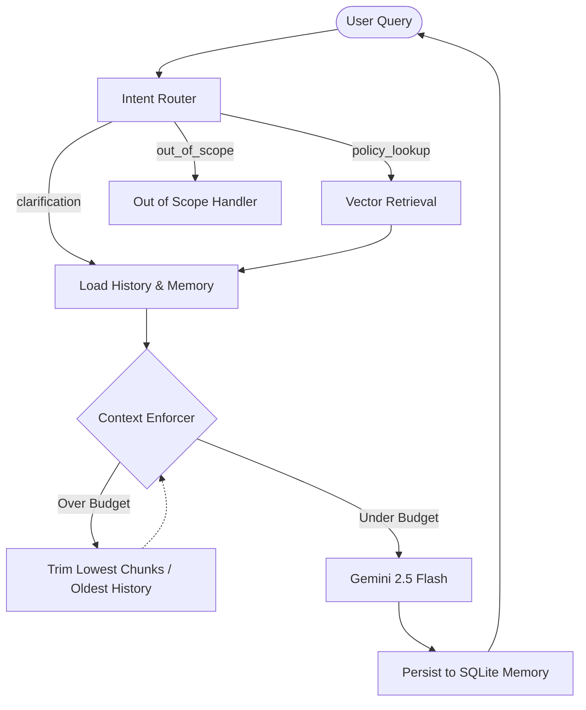
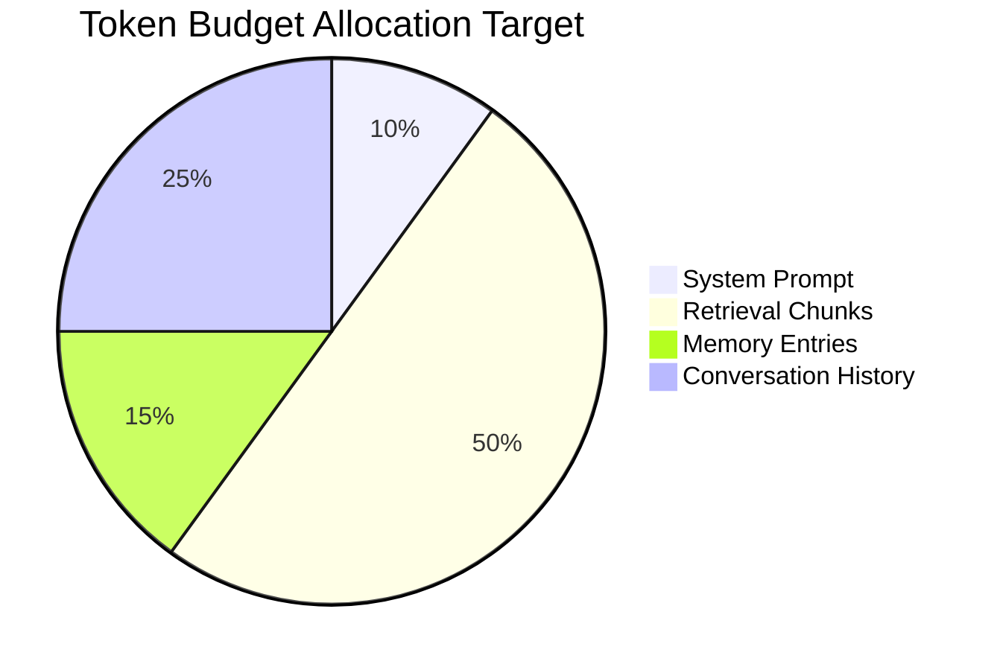

# Context-Engineered RAG

A common challenge when building Retrieval-Augmented Generation (RAG) agents is managing context limits. When users have extended conversations, the combined size of the system prompt, retrieved documents, and conversation history can silently exceed the LLM's token limit. This often results in API truncation, dropped documents, and hallucinated answers.

This repository implements a LangGraph RAG agent with a strict **Context Budget Enforcer**. It mathematically limits tokens across the system prompt, retrieval chunks, memory, and conversation history. If the payload approaches the limit, the enforcer systematically drops the oldest conversation turns or lowest-scoring chunks to guarantee a pristine, under-budget prompt.

## Technologies

- **Agent Orchestration**: LangGraph
- **LLM**: Google Gemini 2.5 Flash (for both routing and evaluation)
- **Vector / Fact Storage**: SQLite (Memory Store)
- **Observability & Tracing**: Arize Phoenix & OpenTelemetry (OTEL)
- **Evaluations**: Phoenix Evals (`LLM-as-a-judge`), Pandas
- **Testing**: Pytest

## Architecture

The system is built using LangGraph to route intents, retrieve context, enforce token budgets, and generate responses.



## Context Engineering

Instead of blindly injecting retrieved chunks into the prompt, the Enforcer calculates the token cost of four distinct zones before the LLM is called.



The **Context Budget Enforcer** operates under a strict `TOTAL_BUDGET`. If the aggregated payload crosses this threshold, it initiates a cascading trim:
1. **Conversation Trimming**: Oldest user/assistant messages are dropped first.
2. **Retrieval Trimming**: Low-scoring vector chunks are dropped next.
3. **Emergency Trimming**: If the payload is still too heavy, it falls back to emergency truncation, heavily prioritizing the rigid System Rules and core Memory over raw context.

## Core Components

- **`context_enforcer`**: The node that trims tokens to guarantee the prompt stays within budget constraints.
- **`router`**: Intent classification (`policy_lookup`, `clarification`, `out_of_scope`) using Gemini Flash to prevent expensive RAG lookups on basic conversational queries.
- **`memory_store`**: SQLite-backed memory to persist facts and context across conversation turns.
- **`evals`**: A 5-metric evaluation suite (Router Accuracy, Source Coverage, Answer Correctness, Hallucination, Faithfulness) utilizing `phoenix-evals`.
- **`tracing`**: Full OpenTelemetry observability via Arize Phoenix to visualize token consumption and span latencies.

## Getting Started

### Prerequisites
- Python 3.10+
- `GOOGLE_API_KEY` exported in your environment (for Gemini models)

### Installation
1. Clone the repository and install dependencies:
```bash
pip install -r requirements.txt
```

2. Initialize tracing locally:
To view the traces and evaluation metrics, you need to run Arize Phoenix. This is automatically handled by the initialization scripts, which launch Phoenix at `http://localhost:6006`.

### Running Tests and Evaluations

To validate the architecture, the project includes an automated test suite and LLM-as-a-judge evaluators.

```bash
# 1. Start the test suite to generate execution traces
python -m scripts.run_test_suite

# 2. Run the LLM evaluators against the recorded Phoenix traces
python -m scripts.run_evals
```

*Note: The LLM-as-a-judge evaluators use `asyncio` batching for high-throughput grading.*
